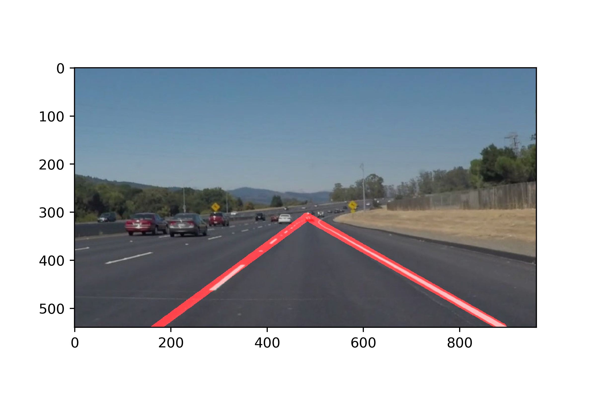
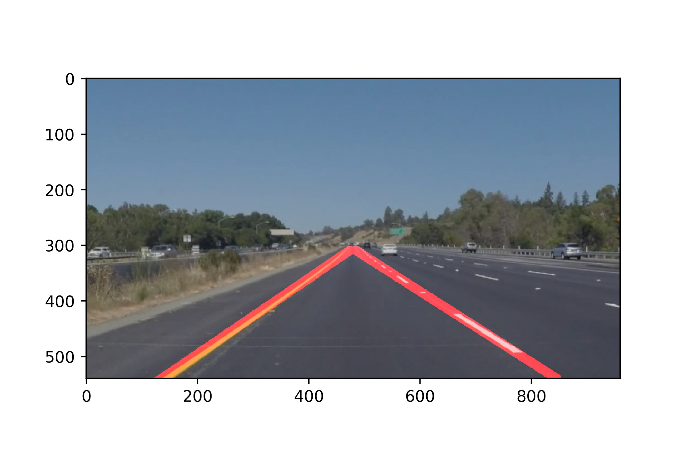

# **Finding Lane Lines on the Road** 

---

**Finding Lane Lines on the Road**

The goals / steps of this project are the following:
* Make a pipeline that finds lane lines on the road
* Reflect on your work in a written report

[//]: # (Image References)

[image1]: ./examples/grayscale.jpg "Grayscale"

---

### Reflection

### 1. Describe your pipeline. As part of the description, explain how you modified the draw_lines() function.

Lane lines finding is achieved with the following steps:
First, I filter colors on the image so that only white and yellow pixels are included as these are the colors of the lane lines. Next I convert image to grayscale and apply gaussian blur to remove noise. The resulting image is used as an input to Canny edge detection algorithm. This algorithm detects edges using the intensity gradients of the image at each pixel - high magnitude of the gradient means there is a rapid change in the colors, whereas small magnitude of the gradient means there is no sudden change. After calculating gradients non-max suppression is applied to remove non-maximum pixels thus thinning the detected edges.
After edge detection I've applied a mask to remove elements that are not inside the region of interest - trapezoidal region in front of the car. Hough line transform is then used to find straight lines on the image. In order to combine multiple detected lines together I first separate them into two groups - based on whether their slope is less than or greater than zero (left and right lane lines respectively). After that I average their slopes and intercepts to obtain a slope and intercept for the combined lines. From there it is easy to calculate the coordinates of two points that would define the line for drawing.

Here's examples of the detected lines with white-colored lines

and yellow-colorer line

### 2. Identify potential shortcomings with your current pipeline

There could be several cases where this pipeline won't work well:
1. It probably won't work well on curvy lines
2. When there are no lane lines present
3. When the lines are other colors than yellow or white

### 3. Suggest possible improvements to your pipeline

I think it would make sense to apply some averaging (perhaps exponential weighted moving average) when this pipeline is applied to videos. It should help for the cases, when there are no lines detected due to, for example, lightning conditions
