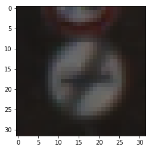
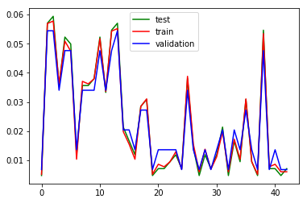
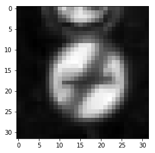
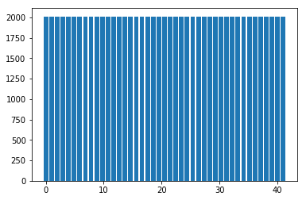
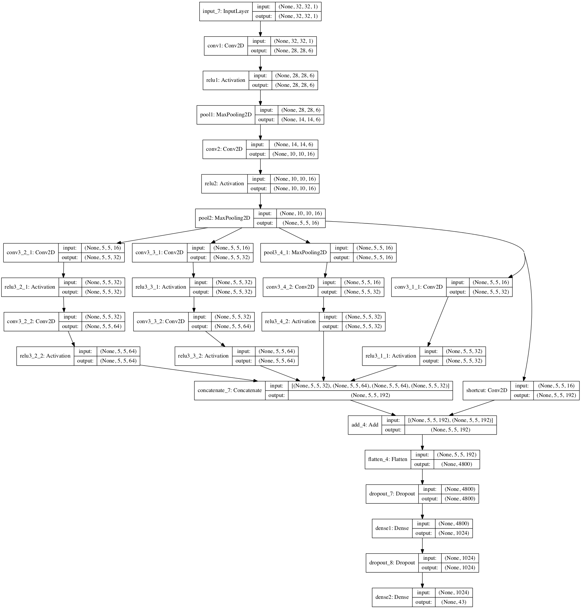
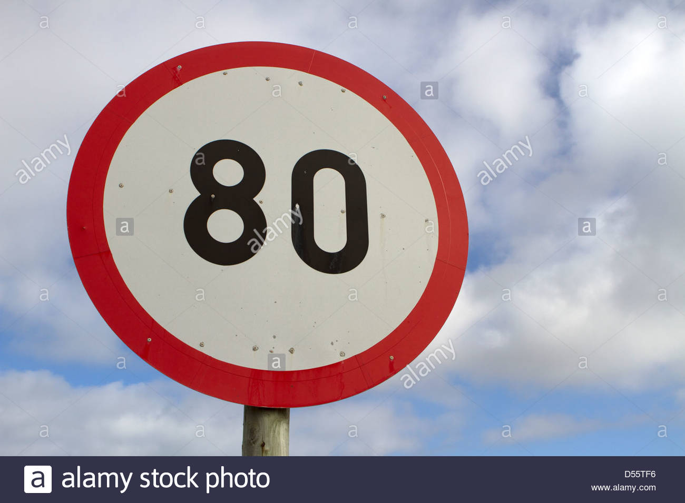
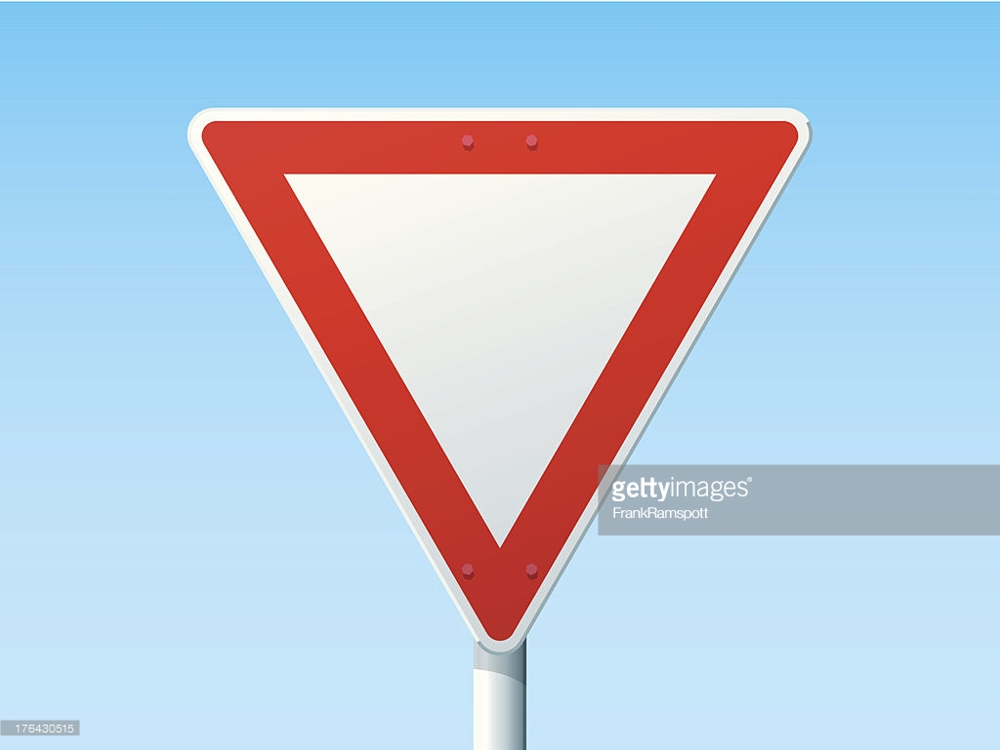

# **Traffic Sign Recognition** 

## Writeup

### You can use this file as a template for your writeup if you want to submit it as a markdown file, but feel free to use some other method and submit a pdf if you prefer.

---

**Build a Traffic Sign Recognition Project**

The goals / steps of this project are the following:
* Load the data set (see below for links to the project data set)
* Explore, summarize and visualize the data set
* Design, train and test a model architecture
* Use the model to make predictions on new images
* Analyze the softmax probabilities of the new images
* Summarize the results with a written report

## Rubric Points
### Here I will consider the [rubric points](https://review.udacity.com/#!/rubrics/481/view) individually and describe how I addressed each point in my implementation.  

---
### Writeup / README

#### 1. Provide a Writeup / README that includes all the rubric points and how you addressed each one. You can submit your writeup as markdown or pdf. You can use this template as a guide for writing the report. The submission includes the project code.

You're reading it :)

### Data Set Summary & Exploration

#### 1. Provide a basic summary of the data set. In the code, the analysis should be done using python, numpy and/or pandas methods rather than hardcoding results manually.

I used the numpy library to calculate summary statistics of the traffic
signs data set:

* The size of training set is 34799 RGB images with shape 32 x 32 x 3
* The size of the validation set is 4410 RGB images with shape 32 x 32 x 3
* The size of test set is 12630 RGB images with shape 32 x 32 x 3
* The shape of a traffic sign image is 32 x 32 x 3
* The number of unique classes/labels in the data set is 43

#### 2. Include an exploratory visualization of the dataset.

Here is an exploratory visualization of the data set. Example of the sign image:

The following plot shows the proportion of images of each class in the dataset:

As you can see, the distribution of classes across training, validation and test sets is roughly the same. The classes are, however, not balanced inside the training set.

### Design and Test a Model Architecture

#### 1. Describe how you preprocessed the image data. What techniques were chosen and why did you choose these techniques? Consider including images showing the output of each preprocessing technique. Pre-processing refers to techniques such as converting to grayscale, normalization, etc. (OPTIONAL: As described in the "Stand Out Suggestions" part of the rubric, if you generated additional data for training, describe why you decided to generate additional data, how you generated the data, and provide example images of the additional data. Then describe the characteristics of the augmented training set like number of images in the set, number of images for each class, etc.)

During preprocessing step RGB channels of each image were first averaged into one channel, providing conversion to grayscale. Next each pixel value was normalized. The result can be seen on the picture:

Since training dataset was imbalanced, I've decided to add augmented data for each class, which has less examples than the class with largest number of images. As augmentation methods I've chosen three, which are most commonly used and which, at the same time, should help increase the accuracy:
* rotation (by random angle)
* vertical flip (i.e. creating a mirrored image)
* adding Gaussian noise
These were applied randomly to random images of each class until the total ammount of images for the given class was the same as that of the largest class.
The distribution of number of images per class after the augmentation follows the expected pattern :)

#### 2. Describe what your final model architecture looks like including model type, layers, layer sizes, connectivity, etc.) Consider including a diagram and/or table describing the final model.

The architecture of my final model is the following:

#### 3. Describe how you trained your model. The discussion can include the type of optimizer, the batch size, number of epochs and any hyperparameters such as learning rate.

To train the model, I used an AdamOptimizer with 0.0009 learning rate. The rest hyperparameters of Adam were left default. The batch size was 128. The model was trained for 20 epochs, though the required minimum accuracy of validation set was achieved after 4 epochs.

#### 4. Describe the approach taken for finding a solution and getting the validation set accuracy to be at least 0.93. Include in the discussion the results on the training, validation and test sets and where in the code these were calculated. Your approach may have been an iterative process, in which case, outline the steps you took to get to the final solution and why you chose those steps. Perhaps your solution involved an already well known implementation or architecture. In this case, discuss why you think the architecture is suitable for the current problem.

My final model results were:
* training set accuracy of 0.998
* validation set accuracy of 0.944 
* test set accuracy of 0.929

The initial model was LeNet-5 as suggested in the lectures. However I was getting quite low accuracy, which indicated that the model couldn't generalize well given such a small network. The obvious way to fix this is to make the model deeper. I've decided to add a sort of inception-resnet module:
inception part was following the architecture of inception block in Inception-V1 (namely, the outputs of 1x1 convolution, 1x1 convolution followed by 3x3 convolution, 1x1 convolution followed by 5x5 convolution, maxpooling followed by 1x1 convolution were concatenated on their filter axis);
whereas for shortcut connection I had to do 1x1 convolution first in order to increase number of filters so that the output of inception part and shortcut could be added element-wise.
In residual connection using the initial number of filters was problematic due to the small number of filters I would have to use inside inception block to get the same initial number after inception concatenation - the input to the inception-resnet layer had only 16 filters and I've decided that keeping the output number of filters the same wouldn't provide any value (since I would have to either significantly reduce the number of filters at each convolution step or use the same number of filters).
Since the output of these grew in size I've also increased the number of neurons in the first fully connected layer. And added dropout to reduce overfitting (though it seems like I wasn't too successful in doing so, as there is quite a large gap between accuracies of training and validation set and even larger gap to the test set accuracy)
 

### Test a Model on New Images

#### 1. Choose five German traffic signs found on the web and provide them in the report. For each image, discuss what quality or qualities might be difficult to classify.

Here are five German traffic signs that I found on the web:

Based on what I've seen for the images in the dataset, the images I've found are coming from a different distribution. Also it seems like resizing the images made them less readable (at least for the human eye).
Due to both of these facts I was expecting a low accuracy for the trained network.

#### 2. Discuss the model's predictions on these new traffic signs and compare the results to predicting on the test set. At a minimum, discuss what the predictions were, the accuracy on these new predictions, and compare the accuracy to the accuracy on the test set (OPTIONAL: Discuss the results in more detail as described in the "Stand Out Suggestions" part of the rubric).

Here are the results of the prediction:

| Image			        |     Prediction	        					| 
|:---------------------:|:---------------------------------------------:| 
| Speed Limit 80km/h	| Right-of-way at the next intersection			| 
| No passing  			| Traffic signals								|
| Yield					| Yield											|
| Bumpy road      		| Bicycles crossing				 				|
| Turn left ahead		| Vehicles over 3.5 metric tons prohibited		|

As expected, the accuracy on the images from the web is low - 20%. The only correctly guessed sign is the "Yield" sign, which is arguably the easiest. The hardest one was, probably, the last one, which was a blue sign against the blue background.

#### 3. Describe how certain the model is when predicting on each of the five new images by looking at the softmax probabilities for each prediction. Provide the top 5 softmax probabilities for each image along with the sign type of each probability. (OPTIONAL: as described in the "Stand Out Suggestions" part of the rubric, visualizations can also be provided such as bar charts)

For the first image, the model is quite sure that this is a right-of-way at the next intersection sign (probability of 0.931), but the image contains a speed limit 80km/h sign. The top five soft max probabilities were

| Probability         	|     Prediction	        					| 
|:---------------------:|:---------------------------------------------:| 
| 0.931        			| Right-of-way at the next intersection			| 
| 0.056    				| Go straight or left							|
| 0.005					| General caution								|
| 0.002	      			| Vehicles over 3.5 metric tons prohibited		|
| 0.002				    | Double curve      							|

For the second image, the model is quite sure that this is a traffic signals sign (probability of 0.942), but the image contains a no passing sign. The top five soft max probabilities were

| Probability         	|     Prediction	        					| 
|:---------------------:|:---------------------------------------------:| 
| 0.942        			| Traffic signals								| 
| 0.056    				| General caution								|
| 0.001					| Roundabout mandatory							|
| 0.001	      			| Road work										|
| 0.0003				| Go straight or left  							|

For the third image, the model is confident that this is a yield sign (probability of 1.000), and the image contains a yield sign. The top five soft max probabilities were

| Probability         	|     Prediction	        					| 
|:---------------------:|:---------------------------------------------:| 
| 1.000        			| Right-of-way at the next intersection			| 
| 0.000     			| Bicycles crossing								|
| 0.000					| Turn right ahead								|
| 0.000	      			| Ahead only									|
| 0.000				    | Bumpy road      								|

For the fourth image, the model is relatively sure that this is quite sure that this is a Bicycles crossing sign (probability of 0.919), but the image contains a bumpy road sign. The top five soft max probabilities were

| Probability         	|     Prediction	        					| 
|:---------------------:|:---------------------------------------------:| 
| 0.919        			| Bicycles crossing								| 
| 0.058     			| Road work										|
| 0.007					| Road narrows on the right						|
| 0.005	      			| Traffic signals								|
| 0.005				    | Children crossing    							|

For the fifth image, the model is unsure about the prediction, but vehicles over 3.5 metric tons prohibited sign has the highest probability (0.380), while the image contains a turn left ahead sign. The top five soft max probabilities were

| Probability         	|     Prediction	        					| 
|:---------------------:|:---------------------------------------------:| 
| 0.380        			| Vehicles over 3.5 metric tons prohibited		| 
| 0.302    				| Roundabout mandatory							|
| 0.130					| No passing for vehicles over 3.5 metric tons	|
| 0.090	      			| Turn left ahead								|
| 0.043				    | Speed limit (100km/h)							|

