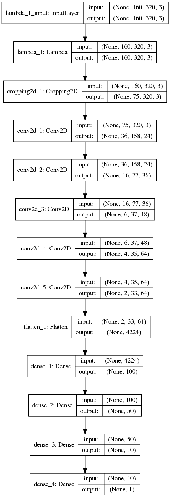
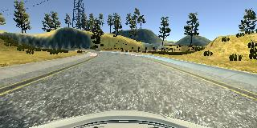

# The aim of this project was to teach a car to drive autonomously in the simulator using a convolutional neural network.

### Submission includes the following files:
1. model.py - script for creating and training the model
2. drive.py - script for driving the car in autonomous mode
3. model.hdf5 - trained convolutional neural network
4. video.mp4 - recording of the car driving autonomously using the pretrained model

### Model Architecture
The model is based on the Nvidia proposed architecture which was shown to be working for the same task https://devblogs.nvidia.com/deep-learning-self-driving-cars/. Briefly, the architecture consists of 5 convolutional layers with ReLU activations followed by three dense layers. Input images are normalised and cropped in order to remove part of the image with the sky.

I’ve decided not to use dropout (as the model was pretty small already) and instead used EarlyStopping callback to stop training automatically when the validation loss stops decreasing.
Optimizer for the model was chosen to be adam, so the learning rate wasn’t tuned manually.

### Data
Training dataset consisted of two parts:
1. Udacity provided dataset
2. Additional data, collected while driving manually both clockwise and counterclockwise on the first track, and also some recovery from left and right sides data.
Only centre view images were used for training.
Here is an example image:

I’ve also used left-right flip for data augmentation to double the size of the dataset.
